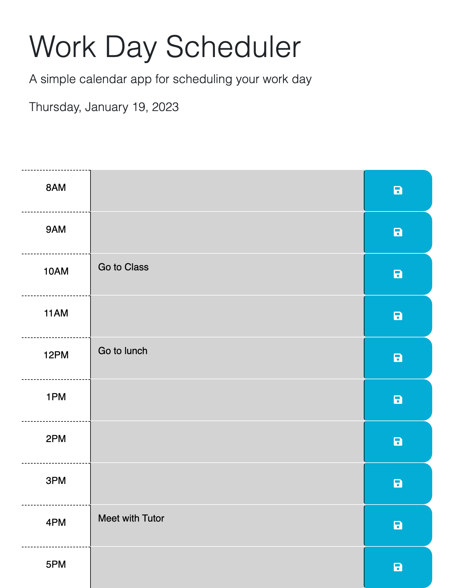

# Work-Day-Scheduler

## Description
The Work Day Scheduler is an application that helps an employee keep track of the task that need to be completed within a work day.

## Usage
When the application loads, the user will the hours of the work day displayed. The current hour will be colored red, the future times will be colored green, and the past times will be colored grey. The user can select the text area that corresponds with the time that they would like to schedule their tasks. When the user clicks the save icon on the right hand side, their tasks are saved. These tasks will persist so they can come back later to refresh their memory of the tasks that must be completed.

## Screenshot

